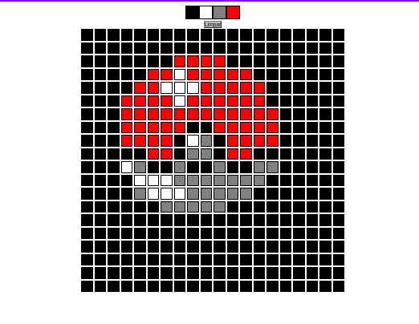

<h1 align="center"> Pixel Art </h1>

 
<h3 align="left"> Sobre: </h3>
 -  👨🏼‍🔧 Este repositorio foi desenvolvido por @tiagoabranges  
 -  ✔️ E um dos projetos proposto pela @betrybe.  
 -  😮 Ele consiste em ser uma página web que contém uma paleta de cores funcional que poderá ser utilizada para criar desenhos em pixels. 

 <h3 align="left"> Foto do Projeto </h3>
 
